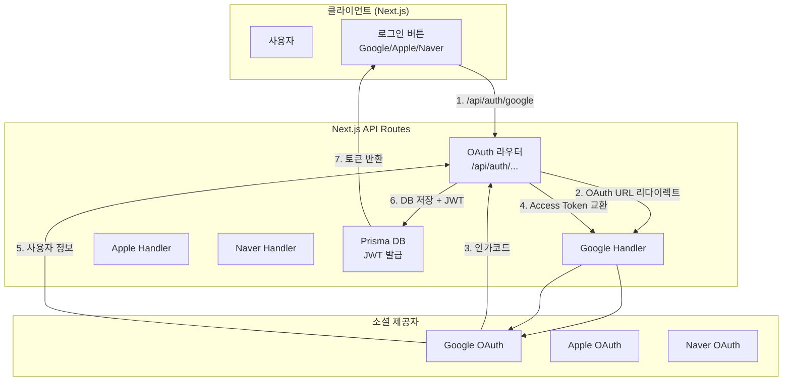

# 소셜 로그인 설계 문서

> **상태**: 설계 단계 (미구현)
> **현재 로그인**: JWT + bcryptjs (이메일/비밀번호)

---

## 1. 시스템 아키텍처 개요

소셜 로그인 기능은 **OAuth 2.0 / OIDC(OpenID Connect)** 프로토콜 기반으로 동작합니다. 백엔드는 Next.js 15 API Routes 환경에서 **NextAuth.js** 또는 커스텀 OAuth 핸들러를 사용합니다. 현재 Passport.js 기반 설계를 참고하되, Next.js App Router에 맞게 조정합니다.



---

## 2. 현재 로그인 vs 소셜 로그인 비교

| 항목 | 현재 (v1.3.0) | 소셜 로그인 (예정) |
|------|--------------|-------------------|
| 인증 방식 | JWT + bcryptjs | OAuth 2.0 + JWT |
| 사용자 등록 | 이메일+비밀번호 | Google/Apple/Naver 계정 |
| 계정 연동 | 불가 | 여러 소셜 계정 연결 가능 |
| CSRF 방어 | 미들웨어 | State 파라미터 검증 |
| 세션 | 3시간 JWT | Access(15m) + Refresh(7d) Token |

---

## 3. 필수 기능 명세

### 3.1 공통 기능 (Provider 통합)

| 기능 | 설명 | 우선순위 |
|------|------|----------|
| `GET /api/auth/{provider}` | 각 소셜 제공자의 인증 페이지로 리다이렉트 | P0 |
| `GET /api/auth/{provider}/callback` | OAuth 콜백 처리 및 사용자 정보 추출 | P0 |
| State 파라미터 검증 | CSRF 공격 방지. 네이버는 필수 | P0 |
| 사용자 식별 매핑 | 제공자별 고유 ID로 사용자 식별 | P0 |
| 계정 연동(Link) | 하나의 계정에 여러 소셜 계정 연결 | P1 |
| 이메일 충돌 처리 | 기존 이메일 계정과 OAuth 계정 충돌 처리 | P1 |

### 3.2 Google OAuth

| 기능 | 설명 | 구현 방식 |
|------|------|------------|
| 인증 시작 | 구글 계정 선택 화면 | `googleapis` 또는 수동 OAuth |
| 사용자 정보 | OpenID Connect id_token 디코딩 | `jose` 라이브러리 |
| 이메일, 이름, 사진 | 기본 프로필 정보 | People API 또는 id_token |
| PKCE 지원 | 보안 강화 | `code_verifier` + `code_challenge` |

### 3.3 Apple Sign In

| 기능 | 설명 | 구현 방식 |
|------|------|------------|
| Client Secret | JWT 기반 동적 생성 (ES256) | `jose` SignJWT |
| 응답 처리 | `form_post` 콜백 | Next.js route handler |
| 사용자 정보 | id_token 디코딩 → sub, email | JWT verify |
| 프라이버시 이메일 | 프록시 이메일 대응 | 실제 이메일 노출 옵션 |

### 3.4 Naver OAuth

| 기능 | 설명 | 구현 방식 |
|------|------|------------|
| 인증 시작 | 네이버 로그인 + **state 필수** | 수동 OAuth 2.0 |
| 사용자 정보 | Access Token → 프로필 API | `openapi.naver.com/v1/nid/me` |
| 이메일 필수 | 검수 전 테스터 ID 등록 필요 | 네이버 개발자 센터 |
| response_type | 항상 `code` | OAuth 2.0 표준 |

---

## 4. DB 스키마 확장 (예정)

```prisma
model User {
  id            String    @id @default(uuid())
  email         String    @unique
  name          String?
  profileImage  String?
  // 기존 필드 유지
  createdAt     DateTime  @default(now())
  updatedAt     DateTime  @updatedAt
  accounts      Account[]  // 소셜 계정 연결
}

model Account {
  id                String   @id @default(uuid())
  userId            String
  user              User     @relation(fields: [userId], references: [id], onDelete: Cascade)
  provider          String   // google, apple, naver
  providerAccountId String   // 제공자별 고유 ID
  accessToken       String?  // 암호화 저장
  refreshToken      String?  // 암호화 저장
  createdAt         DateTime @default(now())

  @@unique([provider, providerAccountId])
}
```

---

## 5. 환경 변수 (추가 예정)

```dotenv
# Google OAuth
GOOGLE_CLIENT_ID=
GOOGLE_CLIENT_SECRET=
GOOGLE_CALLBACK_URL=https://dart-monitor-pi.vercel.app/api/auth/google/callback

# Apple Sign In
APPLE_CLIENT_ID=
APPLE_TEAM_ID=
APPLE_KEY_ID=
APPLE_PRIVATE_KEY=base64-encoded-p8-content
APPLE_CALLBACK_URL=https://dart-monitor-pi.vercel.app/api/auth/apple/callback

# Naver OAuth
NAVER_CLIENT_ID=
NAVER_CLIENT_SECRET=
NAVER_CALLBACK_URL=https://dart-monitor-pi.vercel.app/api/auth/naver/callback
```

---

## 6. Next.js API Route 예제

```typescript
// src/app/api/auth/google/route.ts
import { NextRequest, NextResponse } from "next/server";

export async function GET() {
  const params = new URLSearchParams({
    client_id: process.env.GOOGLE_CLIENT_ID!,
    redirect_uri: process.env.GOOGLE_CALLBACK_URL!,
    response_type: "code",
    scope: "openid profile email",
    state: crypto.randomUUID(),
  });
  return NextResponse.redirect(`https://accounts.google.com/o/oauth2/v2/auth?${params}`);
}
```

```typescript
// src/app/api/auth/google/callback/route.ts
import { NextRequest, NextResponse } from "next/server";
import { prisma } from "@/lib/prisma";
import { signJWT } from "@/lib/auth";

export async function GET(req: NextRequest) {
  const code = req.nextUrl.searchParams.get("code");
  // 1. code → access_token
  const tokenRes = await fetch("https://oauth2.googleapis.com/token", {
    method: "POST",
    headers: { "Content-Type": "application/x-www-form-urlencoded" },
    body: new URLSearchParams({
      code: code!,
      client_id: process.env.GOOGLE_CLIENT_ID!,
      client_secret: process.env.GOOGLE_CLIENT_SECRET!,
      redirect_uri: process.env.GOOGLE_CALLBACK_URL!,
      grant_type: "authorization_code",
    }),
  });
  const { id_token } = await tokenRes.json();

  // 2. id_token 디코딩
  const [header, payload] = id_token.split(".").slice(0, 2);
  const user = JSON.parse(Buffer.from(payload, "base64").toString());

  // 3. DB 사용자 찾기/생성
  let dbUser = await prisma.user.findUnique({ where: { email: user.email } });
  if (!dbUser) {
    dbUser = await prisma.user.create({
      data: { email: user.email, name: user.name, profileImage: user.picture },
    });
  }

  // 4. JWT 발급 + 리다이렉트
  const token = signJWT({ id: dbUser.id, email: dbUser.email });
  return NextResponse.redirect(`https://dart-monitor-pi.vercel.app/dashboard?token=${token}`);
}
```

---

## 7. 보안 체크리스트

| 항목 | 상태 | 비고 |
|------|------|------|
| State 파라미터 검증 | ⬜ | CSRF 방어 |
| HTTPS 강제 | ✅ | Vercel 기본 |
| JWT httpOnly 쿠키 | ✅ | 현재 적용 중 |
| Access Token 암호화 저장 | ⬜ | DB 저장 시 필요 |
| Refresh Token 순환 | ⬜ | 7일 만료 + 재발급 |
| Google PKCE | ⬜ | 공개 클라이언트 권장 |
| Apple Client Secret 만료 | ⬜ | 6개월 주기 갱신 |
| 계정 충돌 처리 | ⬜ | 이메일 중복 시나리오 |

---

## 8. 구현 우선순위

| 순위 | 작업 | 예상 소요 |
|------|------|----------|
| P0 | Google OAuth 연동 | 1-2일 |
| P0 | DB 스키마 확장 (Account 모델) | 1일 |
| P1 | Naver OAuth 연동 | 1-2일 |
| P1 | Apple Sign In 연동 | 2-3일 |
| P1 | 계정 연동 (Link) | 1일 |
| P2 | 이메일 충돌 처리 | 1일 |
| P2 | Refresh Token 구현 | 1일 |
